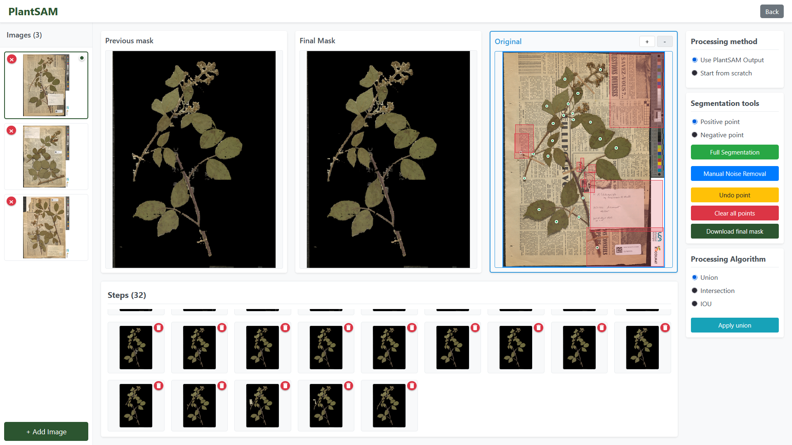

# PlantSAM-App
**Semi-Automatic Annotation Tool for Herbarium Image Segmentation**



## Overview

**PlantSAM-App** is an expert-guided, semi-automatic annotation tool built on top of the [PlantSAM2](https://github.com/IA-E-Col/PlantSAM) segmentation pipeline. It addresses the limitations of fully automatic segmentation by enabling experts to refine masks interactively using point prompts. This correction interface allows the transformation of unusable or incomplete segmentation masks into usable, high-quality annotations.

The tool is designed for:
- **Correcting segmentation errors** in difficult herbarium images
- **Expanding training datasets** for SAM2 fine-tuning
- **Improving accuracy** in trait analysis and downstream tasks

## Key Features

- Automatic pre-segmentation using the PlantSAM2 pipeline
- Interactive correction of masks using **point prompts**
- Image-by-image refinement workflow
- Export of corrected masks for retraining or evaluation
- Lightweight interface (Streamlit-based)

## Installation and Configuration

### **1. Setting up the model**

#### 1. Creating the Python Environment

##### **Option A — Using Python Virtual Environment (`venv`)** *Recommended*

1. Create a virtual environment using `venv`:

   ```bash
   cd ml/
   python3 -m venv PlantSAM2
   ```

2. Activate the environment:

   - On **Linux/macOS**:
     ```bash
     source PlantSAM2/bin/activate
     ```
   - On **Windows**:
     ```bash
     PlantSAM2\\Scripts\\activate
     ```

3. Upgrade `pip`:

   ```bash
   pip install --upgrade pip
   ```

##### **Option B — Using Conda (Legacy or Advanced Users)**

If you prefer using Conda (e.g., for GPU/driver compatibility or institutional setups), you can still use:

```bash
cd ml/
conda create --name PlantSAM2 python==3.11.9
conda activate PlantSAM2
```

#### 2. Installing PyTorch  
Install **PyTorch** following the official instructions:  
[PyTorch Installation Guide](https://pytorch.org/get-started/locally/)  

For exemple if you have CUDA 12.1, execute 

   ```bash
   pip install torch==2.5.1 torchvision torchaudio --index-url https://download.pytorch.org/whl/cu121
   ```

Verify with : 

   ```bash
   python -c "import torch; print(torch.cuda.is_available())"
   ```

It should print true. 

#### 3. Installing Dependencies

1. Install the required packages:  
   ```bash
   pip install -r requirements.txt
   ```
2. Install `sam2` and additional modules:

First, clone SAM2's repository and switch to a stable branch.

   ```bash
      git clone https://github.com/facebookresearch/sam2.git

      cd sam2

      git checkout 86827e2fbae8a293f61d51caa70a4b0602c04454 

   ```

Then upgrade setuptools and install the project in editable mode,

   ```bash
      pip install --upgrade pip setuptools wheel

      pip install --no-build-isolation -e .

      cd ..

   ```

If you experience problems with the definition of the CUDA_HOME or CUDA_PATH variables, here is a way of fixing it,

   ```bash

      $cuda = "C:\Program Files\NVIDIA GPU Computing Toolkit\CUDA\v12.4"
      
      $env:CUDA_HOME = $cuda
      $env:CUDA_PATH = $cuda
      $env:PATH = "$cuda\bin;$cuda\libnvvp;$env:PATH"

   ```

If you want to explore the official guidelines on how to install SAM2 according to the [original repository](https://github.com/facebookresearch/sam2)

If you are installing on Windows, it's strongly recommended to use [Windows Subsystem for Linux (WSL)](https://learn.microsoft.com/en-us/windows/wsl/install) with Ubuntu.

To use the SAM 2 predictor and run the example notebooks, `jupyter` and `matplotlib` are required and can be installed by:

```bash
pip install -e ".[notebooks]"
```

Note:
1. It's recommended to create a new Python environment via [Anaconda](https://www.anaconda.com/) for this installation and install PyTorch 2.5.1 (or higher) via `pip` following https://pytorch.org/. If you have a PyTorch version lower than 2.5.1 in your current environment, the installation command above will try to upgrade it to the latest PyTorch version using `pip`.
2. The step above requires compiling a custom CUDA kernel with the `nvcc` compiler. If it isn't already available on your machine, please install the [CUDA toolkits](https://developer.nvidia.com/cuda-toolkit-archive) with a version that matches your PyTorch CUDA version.
3. If you see a message like `Failed to build the SAM 2 CUDA extension` during installation, you can ignore it and still use SAM 2 (some post-processing functionality may be limited, but it doesn't affect the results in most cases).

Please see [`INSTALL.md`](./INSTALL.md) for FAQs on potential issues and solutions.


#### 4. Installing YOLOv10 

1. Clone the YOLOv10 repository :  
   ```bash
   git clone https://github.com/THU-MIG/yolov10.git
   ```
2. Install YOLOv10 dependencies :  
   ```bash
   cd yolov10
   pip install -r requirements.txt
   pip install -e .
   cd ..
   ```

#### 5. Downloading Models 

Create the `models directory: 

```bash
   mkdir models
   ```
**SAM2 model weights** : [Download the model here](https://drive.google.com/file/d/1WN0pzBcQLIEF3TIMNj9JC7THtsnvds2i/view?usp=sharing)

**YOLOv10** : [Download the model here](https://drive.google.com/file/d/1o-UcVMxktZQuz5DafjSR4T72gimdtujW/view?usp=sharing)

**PlantSAM2** : [Download the model here](https://drive.google.com/file/d/1b57wlX9tCHRp4h92or41aRnBLA38rEfg/view?usp=sharing)


You should add the three models in the "models" repository.

#### 6. Running the API
```bash
   uvicorn api:app --reload --host 0.0.0.0 --port 8000
   ```


### **2. Setting up the Java API**

1. Compile and Install Dependencies
```bash
   cd api/
   ./mvnw clean install
   ```

2. Running the API
```bash
   ./mvnw spring-boot:run
   ```

### **3. Setting up the Interface**

1. Install dependenvies and run the application
```bash
   cd front/
   npm install
   npm run dev
   ```

## Contributors
-  Youcef Sklab — Lead design & integration
-  Adam  Boukheddami — Developer
  
